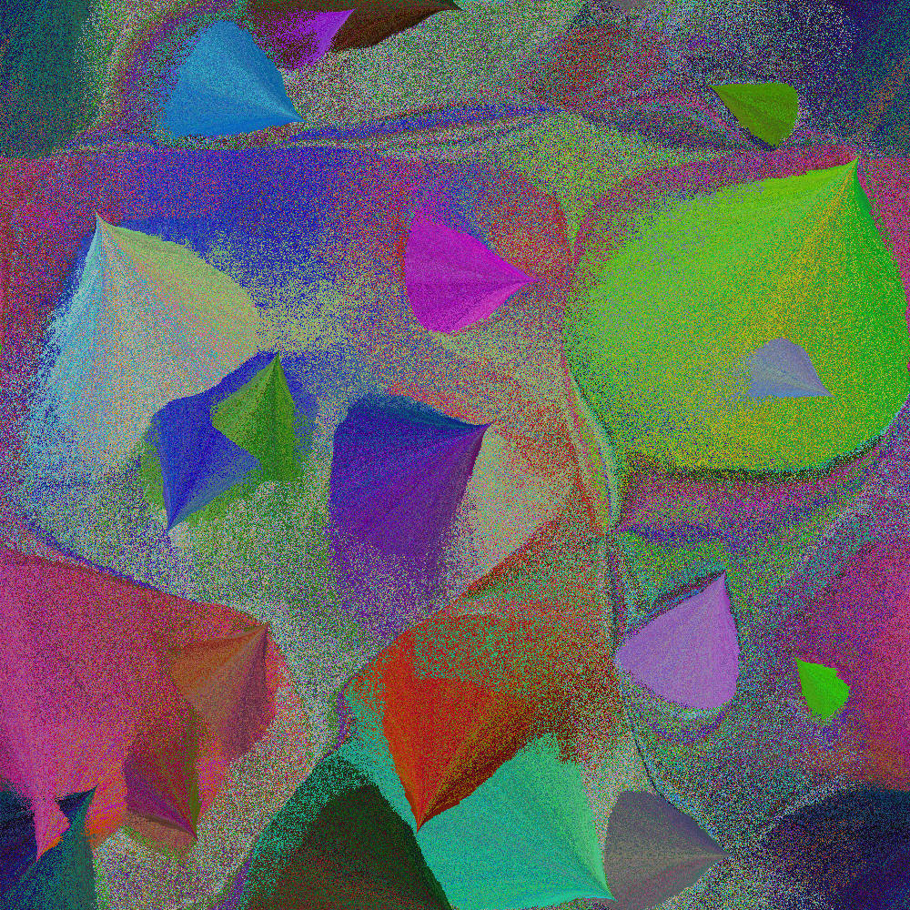

# Fans

Every pixel has a facing angle. Place a few seed pixels with random facing angles, spread over the image. Iterate over all colors in random order. For each color, find the most similarly colored pixel already placed. Find the closest uncolored pixel withtin a small angle of the facing angle of the similar pixel, wrapping around toroidally. Place the new color there. If no such pixel exists, as close as possible.

